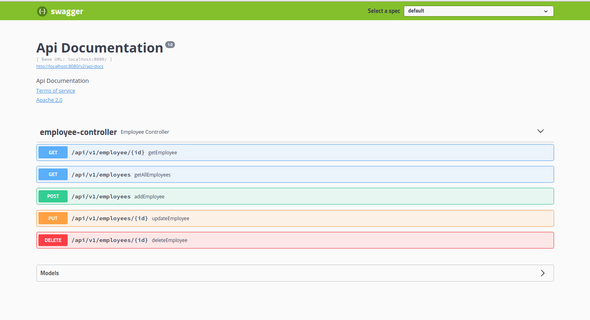

# Dockerized Springboot

## About the project
This tiny project demonstrate how to dockerize a springboot application and run it using a container. It has a main branch and a feature branch. The feature branch contains a bootstrapped springboot project with no furthure functionality added. It then dockerize this app with a standard Dockerfile.


This main branch on the otherhand, focuses on a little bit complicated one. The backend project has some CRUD functionality and rest api. It also focuses on implementing multiple container using docker-compose.


<hr>

## Stacks

- Java
- Springboot
- Postgres
- Docker
- Docker compose

<br/><hr><br/>

### Steps to run the project


1. Download or clone this branch of the project and go to root directory
2. run ``` ./mvnw clean package``` to generate package file
3. Run a postgres server instance with appropriate database configuration according to the ```application.properties``` file.
4. Build image for the springboot app - ```docker build -t <name-of-the-image> . (eg docker build -t springboot-docker .)``` **Don't forget the dot(.)!** 
5. Run a container from this image - ```docker run -it -p 8080:8080 <name-of-the-image> (eg docker run -it -p 8080:8080 springboot-docker)```
6. This will run the application from a container. You can now visit ```http://localhost:8080/swagger-ui.html#/employee-controller``` and see a standard swagger home page for your application.



<br/><hr><br/>
