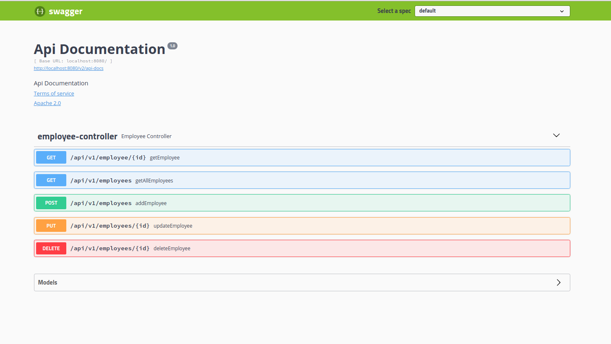

# Dockerized Springboot

## About the project
This tiny project demonstrate how to dockerize a springboot application and run it using a container. It has a main branch and a feature branch. The feature branch contains a bootstrapped springboot project with no furthure functionality added. It then dockerize this app with a standard Dockerfile(please go to the feature branch to no more about how to run the app).

This main branch on the otherhand, focuses on a little bit complicated one. The backend project has some CRUD functionality and rest api. It also focuses on implementing multiple container using docker-compose.


<hr>

## Stacks

- Java
- Springboot
- Postgres
- Docker
- Docker compose

<br/><hr><br/>

### Steps to run the project


1. Download or clone this branch of the project and go to root directory
2. type ```./mvnw clean package``` and hit enter to generate package file
3. give ```docker-compose up``` command to spin up the application. This will build image for the springboot app, run a postgres container, then run a container from the new image just generated.
4. go to ```http://localhost:8080/swagger-ui.html#/``` , you will see a swagger page powered by the app running inside container



<br/><hr><br/>
